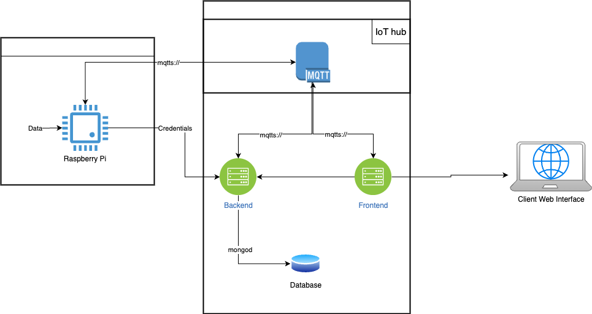

# MQTT-Python
To connect to Azure IoT Hub using the Paho MQTT library, you need to handle the specifics of Azure IoT Hub authentication, SSL/TLS, and the MQTT protocol. Azure IoT Hub uses X.509 certificates or Shared Access Signatures (SAS) for authentication. 


# Connecting to Azure IoT Hub using Paho MQTT with SSL and SAS

This guide demonstrates how to connect to Azure IoT Hub using the Paho MQTT library in Python with SSL/TLS and SAS token authentication.

## Prerequisites

1. **Install the Paho MQTT library**:
   ```bash
   pip install paho-mqtt

1. Azure IoT Hub credentials:
	•	IoT Hub hostname
	•	Device ID
	•	Shared Access Key for the device
1.	Python Environment:
  Ensure Python 3.7+ is installed.

1. Code Implementation-> [HERE](https://github.com/CamiloCamachoV/MQTT-Python/blob/main/mqtt_client.py).

1. Explanation

  1.1 Azure IoT Hub Hostname
    Replace your-iot-hub.azure-devices.net with your IoT Hub’s hostname.

  1.1 Device ID and Key
    Replace your-device-id and your-shared-access-key with your IoT Hub device credentials.

  1.1 SAS Token
    The function generate_sas_token creates a token with a default expiry of 1 hour (3600 seconds). Adjust the expiry parameter if needed.

  1.1 TLS/SSL
    The ssl.create_default_context() ensures secure communication with Azure IoT Hub over port 8883.

1.1 Username and Password
  Azure IoT Hub requires:
	  •	Username: {hostname}/{device_id}/?api-version=2021-04-12
	  •	Password: SAS token.
1.1 Topics
	•	Publish to: devices/{DEVICE_ID}/messages/events/
	•	Subscribe to: devices/{DEVICE_ID}/messages/devicebound/#

## Architecture

 

 ## Notes
 Ensure you follow Azure IoT Hub security best practices when managing device keys and SAS tokens. Rotate keys periodically to maintain a secure environment.


## References
[How to use mqtt in python](https://www.emqx.com/en/blog/how-to-use-mqtt-in-python)
 
